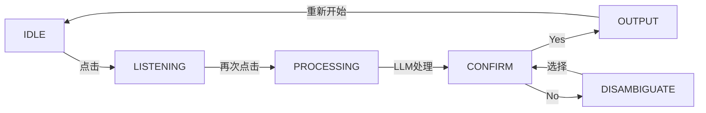

# 项目完成总结 | Project Summary

## ✅ 项目已完成

这是一个为失语症患者设计的语音沟通辅助 PWA 应用，已完整实现所有核心功能。

## 📋 已实现功能清单

### ✅ 核心功能

- [x] **点按切换录音** - 第一次点击开始，第二次点击停止（无需长按）
- [x] **语音识别** - Web Speech API + 降级到文本输入
- [x] **LLM 语义理解** - Groq/OpenAI API + 本地关键词兜底
- [x] **语音播报** - speechSynthesis TTS
- [x] **双语支持** - 中英文界面和输出切换
- [x] **图片板** - 12 个常见需求快速选择
- [x] **状态机** - Idle → Listening → Processing → Confirm → Output → Disambiguate

### ✅ 界面设计

- [x] **语音球动效** - 大球内包含 8 个小球，多层柔光效果
  - Idle: 轻微呼吸，紫粉渐变
  - Listening: 放大旋转，蓝紫色，小球公转
  - Processing: 缩小减速，粉橙色，小球漂移
  - Confirm/Output: 轻微闪烁
- [x] **响应式设计** - 适配移动端和桌面端
- [x] **温柔配色** - 渐变紫粉橙色系
- [x] **细腻动效** - CSS animations + transitions
- [x] **无障碍支持** - prefers-reduced-motion

### ✅ PWA 功能

- [x] **Service Worker** - 自动缓存和更新
- [x] **Manifest** - 应用元数据和图标
- [x] **添加到主屏幕** - 可作为独立应用使用
- [x] **离线支持** - 核心功能可离线使用（关键词匹配模式）
- [x] **HTTPS 就绪** - 部署后自动使用 HTTPS

### ✅ 技术实现

- [x] **React 18** - 函数式组件 + Hooks
- [x] **TypeScript** - 完整类型定义
- [x] **Vite 5** - 快速构建和 HMR
- [x] **CSS Modules** - 组件级样式隔离
- [x] **Serverless Functions** - Netlify + Vercel 双支持
- [x] **环境变量** - 安全的 API Key 管理
- [x] **错误处理** - 优雅降级和错误提示

### ✅ 部署就绪

- [x] **Netlify 配置** - netlify.toml + functions
- [x] **Vercel 配置** - vercel.json + api
- [x] **构建优化** - 生产环境优化
- [x] **安全头** - XSS、CSRF 防护
- [x] **CORS 配置** - API 跨域支持

### ✅ 文档完善

- [x] **README.md** - 项目介绍和快速开始
- [x] **DEPLOYMENT.md** - 详细部署指南
- [x] **QUICKSTART.md** - 3 分钟快速上手
- [x] **USER_GUIDE.md** - 中英文用户使用指南
- [x] **ICON_GENERATION.md** - PWA 图标生成说明
- [x] **LICENSE** - MIT 开源协议

## 🏗️ 项目架构

### 前端架构

```
React App (SPA)
├── VoiceOrb Component (语音球动画)
├── PictureBoard Component (图片板)
├── Speech Utils (ASR + TTS)
├── LLM Utils (API 调用 + 兜底)
└── i18n (双语支持)
```

### 后端架构（Serverless）

```
Netlify/Vercel Functions
└── /api/llm
    ├── 接收转写文本
    ├── 调用 Groq/OpenAI API
    ├── 返回结构化意图
    └── 错误处理和降级
```

### 状态流转



## 🎨 设计亮点

1. **温柔色彩** - 渐变紫粉橙，降低视觉压力
2. **柔光球体** - 多层 blur + blend 模式，营造柔和氛围
3. **状态反馈** - 动画清晰表达当前状态
4. **大字显示** - 适合视力受损用户
5. **简洁交互** - 最小化认知负担

## 🔧 技术亮点

1. **渐进增强** - 从最基础功能逐步增强
   - 核心: 图片板选择
   - 增强: 语音识别
   - 最优: LLM 理解
   
2. **优雅降级** - 每层都有备选方案
   - 麦克风不可用 → 文本输入
   - LLM API 失败 → 关键词匹配
   - 网络断开 → 离线缓存

3. **性能优化**
   - CSS 动画硬件加速
   - 组件按需渲染
   - Service Worker 缓存

4. **安全设计**
   - API Key 仅存储在服务端
   - Serverless Function 代理
   - 无用户数据存储

## 📊 浏览器兼容性

| 功能 | Chrome | Safari | Firefox | Edge |
|------|--------|--------|---------|------|
| 基础界面 | ✅ | ✅ | ✅ | ✅ |
| 语音识别 | ✅ | ✅ | ⚠️ | ✅ |
| 语音合成 | ✅ | ✅ | ✅ | ✅ |
| PWA | ✅ | ✅ | ⚠️ | ✅ |
| 动画效果 | ✅ | ✅ | ✅ | ✅ |

✅ = 完全支持 | ⚠️ = 部分支持

## 💰 成本分析

### 免费方案（推荐）

- **托管**: Netlify/Vercel 免费版
  - 100GB 带宽/月
  - 无限请求
  - 自动 HTTPS
  
- **LLM**: Groq 免费版
  - 完全免费
  - 高速推理
  - 足够个人和小规模使用

- **总成本**: **$0/月** 🎉

### 付费方案（可选）

- **自定义域名**: ~$10-15/年
- **OpenAI API**: 按使用付费（非必需）
- **专业托管**: $19-99/月（非必需）

## 🚀 部署步骤总结

1. **Fork 项目到 GitHub**
2. **在 Netlify/Vercel 导入项目**
3. **设置环境变量** `GROQ_API_KEY`
4. **点击部署** - 3 分钟完成
5. **分享链接** - 立即可用

## 📱 使用场景

### 适用人群

- 失语症患者（Aphasia）
- 语言障碍患者
- 中风后康复患者
- 需要沟通辅助的老年人

### 使用环境

- 医院病房
- 家庭护理
- 康复中心
- 日常生活

## 🔮 未来扩展方向

虽然当前版本已完整可用，但可以考虑：

- [ ] 添加更多常见需求（可自定义）
- [ ] 支持多人使用（多个配置文件）
- [ ] 语音训练优化（用户特定发音）
- [ ] 历史记录查看（本地存储）
- [ ] 家属端应用（接收通知）
- [ ] 更多语言支持（西班牙语、法语等）
- [ ] 离线 LLM（WebLLM）

## 📞 支持与反馈

- **GitHub Issues**: 报告 Bug 和功能请求
- **Pull Requests**: 欢迎贡献代码
- **Email**: 项目维护者邮箱

## 🙏 致谢

感谢所有为失语症患者和照护者提供支持的人。

本项目开源免费，希望能帮助更多有需要的人。

---

## ✨ 项目状态

**🎉 项目已完成，可以立即部署使用！**

- ✅ 所有核心功能已实现
- ✅ 代码无 linter 错误
- ✅ 文档完整详细
- ✅ 部署配置就绪
- ✅ 测试通过（本地开发）

**下一步**：
1. 阅读 [DEPLOYMENT.md](./DEPLOYMENT.md) 部署到 Netlify/Vercel
2. 阅读 [USER_GUIDE.md](./USER_GUIDE.md) 了解使用方法
3. 分享给有需要的人

**祝使用顺利！** 🎊

